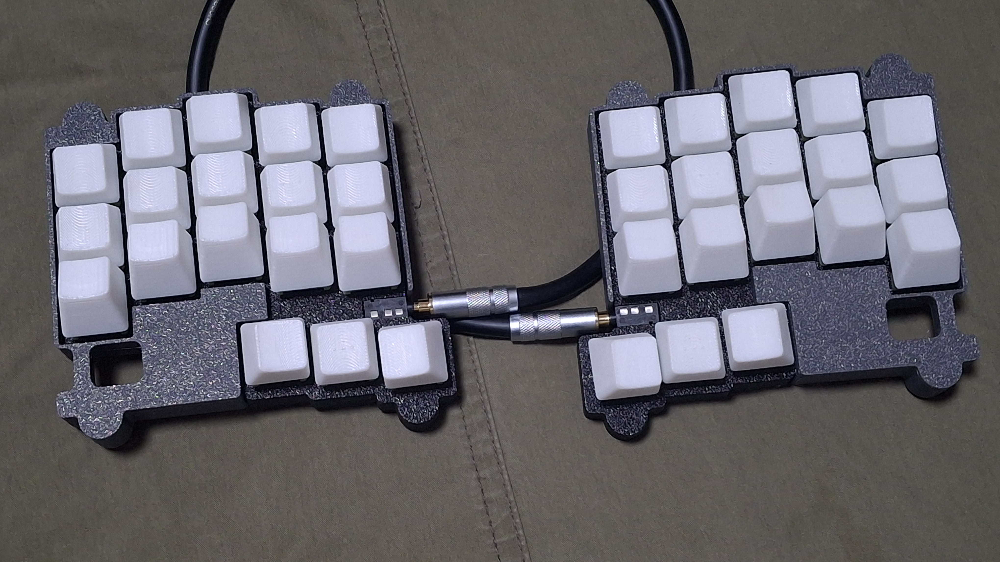

# Boardloaf

36 key hotswappable split keyboard in 100x100 pcb

## Preparation

- 2x rp2040 zero (boards formly created by waveshare) (Approx. 4-8$)

- 2x Boardloaf PCB Boards (5 boards are 2$ on JLC w/o shipping cost)

- 1x printed case sets, which you want to make it (4$ for sandwitch, Approx. 12$ if you buy printed one)

- 36x diodes (Approx. 1$)

- (for V1) 32x M2x4 bolts, 16x M2x7 spacers (under 4mm radius) (Approx. 2$)

- (for V2) 16x M2x7 screws, flathead (can use M2x6 or M2x8) (Approx. 1$)

- 2x PJ320A 1/8(3.5mm) TRRS connector (Approx. 1$)

- 1x 1/8(3.5mm) TRRS cable (Approx. 2$, may TRS cable can take the place.)

- 36x Keyswitches & Keycaps & Hotswap SMD (Maybe this cost varies too much. 10$ on average)

Approx. 26$-37$(w/o shipping cost) needed to build one.

## Build Guides

work in progress. sorry!

You can see the images in the folder, which uploaded for build guides. Especially you may see how to solder the controller board, because this uses surface mounting by castelated pins.

Images are captured with prototype version PCB, which is different from the current gerber. Current gerber has two "Jump when back side" jumper point on each side, to check which hand is on the position. You may see diode jumper on assembly image for the same role, and you don't need to jump via diodes if you jump jumpers correctly.

This uses [qmk](https://qmk.fm/) to build the firmware. Copy "boardloaf" folder which is in "firmware/qmk" directory to "qmk_firmware\keyboards" folder, and build it via qmk msys.

Or, simply flash uf2 in "uf2Examples" folder by changing rp2040 zero in dfu mode, which can be executed by holding boot button while plugging in usb c. Vial versions are work in progress.

## Licenses

miryoku keymap follows GNU GPL 2.0 license.

all other codes follow MIT license.

all designs and the hardware board follow CC BY-SA 4.0 license.

If you want to make a commercial product, it would be appreciated if you sponsor some bucks for me.
